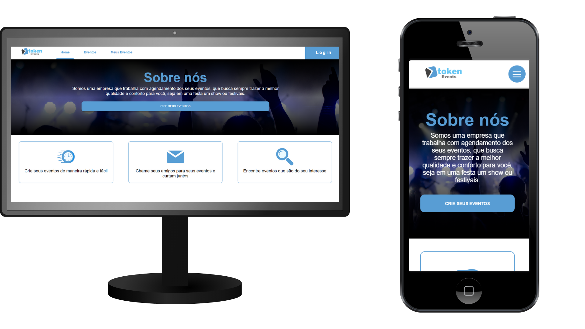

<h3 align="center">
    
</h3>

<h3 align="center">Token Events</h3>

<div align="center">

  <a href="https://www.linkedin.com/in/leonardo-altemari-008a8017b/">
    
  </a>

  <a href="https://github.com/leoaltemari/tokenEvents-React/blob/master/LICENSE">
    
  </a>

</div>

---

### 📺 Apresentação:

<strong>Token Events</strong> consiste em uma página web feita para um desafio técnico para as vagas de estagiário/CLT da empresa <a href="https://www.tokenlab.com.br/pt/" target="_blank">TokenLab - São Carlos</a>. 
A aplicação é um calendário de eventos, onde o usuário consegue criar eventos, editar eventos já existentes, remover eventos criados e também convidar outros usuários para seus eventos. Para que tudo ocorra, o usuário deve possuir uma conta na aplicação e estar logada nela para realizar as ações.

<h3 align="center">
    
</h3>

---

### 🚀 Tecnologias utilizadas

-   [React JS](https://pt-br.reactjs.org/)
-   [React-Router](https://reactrouter.com/)
-   [React-Calendar](https://www.npmjs.com/package/react-calendar)
-   [Node.js](https://nodejs.org/en/)
-   [Axios](https://www.npmjs.com/package/axios)
-   [HTML 5](https://developer.mozilla.org/pt-BR/docs/Web/HTML)
-   [CSS 3](https://developer.mozilla.org/pt-BR/docs/Web/CSS)
-   [JavaScritp(ES6)](https://www.javascript.com/)

---

### 🔥 Instalação e inicialização

#### Pré-requisitos

-   É <strong>necessário</strong> ter instalado o [Node.js](https://nodejs.org/en/) qualquer versão <strong>acima de 10</strong>.
-   O projeto foi desenvolvido utilizando o gerenciador de pacotes NPM.
-   <strong>Para o funcionamento completo da aplicação </strong> é necessário estar rodando a API que foi desenvolvida [TokenEvents-API](https://github.com/leoaltemari/tokenEvents-API).
-   Siga o tutorial na <strong>documentação da API</strong> para rodar ela.

##### 1º ⏩ Faça o clone do repositório:

```sh
    $ git clone https://github.com/leoaltemari/tokenEvents-React.git
```

##### 2º ⏩ Entre na pasta do projeto

```sh
    $ cd .\tokenEvents-React\
```

##### 2º ⏩ Instale as dependências usando NPM e execute a aplicação:

-   Instalando dependências

```sh
    # Instale as dependências com o seguinte comando:
    $ npm install
```

-   Iniciando a aplicação

```sh
    # Aguarde a instalação das dependencias e em seguida inicie a aplicação
    $ npm start

    # Automaticamente será aberta uma janela no seu navegador definido como padrão.
    # Caso isso não ocorra acesse: http://localhost:3000/.
```

---

### 🔐 Licença

Esse projeto está sob a licença MIT. Veja o arquivo [LICENSE](LICENSE) para mais detalhes.
